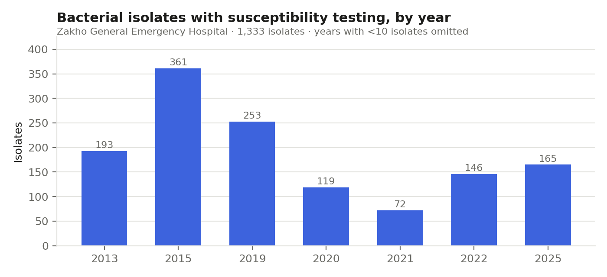
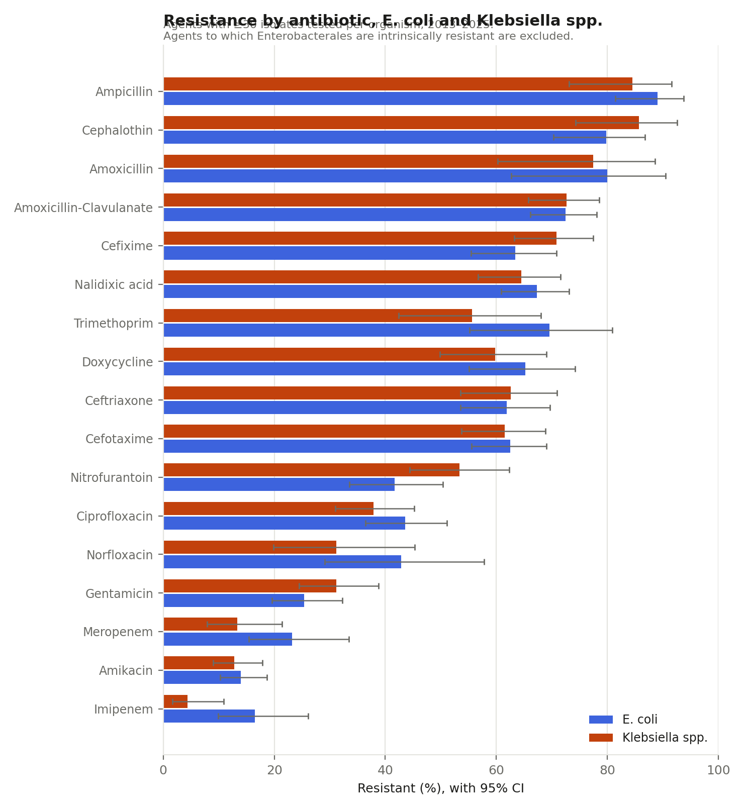
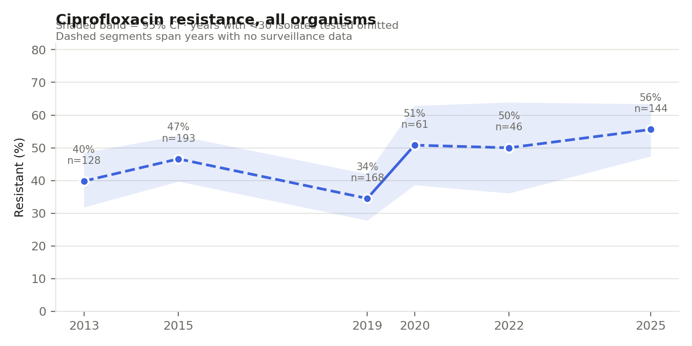

# AMR-Trends-Kurdistan-Iraq

**Antimicrobial resistance surveillance in a secondary-care hospital, Kurdistan Region of Iraq (2013–2025)(non-continuous)**

[](https://opensource.org/licenses/MIT)
[](#status)

---

## Overview

This repository holds an antimicrobial resistance (AMR) surveillance dataset
assembled from the microbiology laboratory records of Zakho General Emergency
Hospital, Kurdistan Region of Iraq, covering 2013–2025.

The Kurdistan Region of Iraq does not appear in the major international
resistance surveillance networks (WHO GLASS, EARS-Net). Routine susceptibility
testing is carried out in hospitals across the region, but the results are
read once, filed, and rarely aggregated or analysed over time. This dataset is
an attempt to close part of that gap for one hospital.

The work is carried out independently, without research funding or academic
supervision, alongside full-time laboratory employment.

---

## Status

**Analysis complete for the core dataset.**

1,333 isolates analysed across 2013–2025. Resistance rates are reported
per organism, with denominators and 95% confidence intervals, for agents
with at least 30 isolates tested (CLSI M39).

Surveillance is not continuous: no records are held for 2016–2018 or
2023–2024, and 2014 contributes 2 isolates.

## Findings







Among the two most frequently isolated organisms, carbapenems and
amikacin retain the greatest activity: imipenem resistance is 16.5% in
*E. coli* (n=79) and 4.4% in *Klebsiella* spp. (n=90); amikacin is 14.0%
(n=265) and 12.8% (n=218) respectively. Aminopenicillins, first-
generation cephalosporins and third-generation cephalosporins show
resistance above 60% in both organisms.

Ciprofloxacin resistance across all organisms rose from 40% in 2013
(n=128) to 56% in 2025 (n=144), with a lower figure of 34% recorded in
2019 (n=168).

### Unresolved antibiotic codes

Some columns in the historical records use codes that are labelled
inconsistently across years — `CL` appears as both colistin and
cephalexin — or are unlabelled (`AME`, `CAN`, `CEO`, `MEIL`, `MEK`,
`MPM`, `TPM`). These results are excluded pending confirmation with the
laboratory rather than assigned to a drug by inference.


---

## Dataset

| | |
|---|---|
| **Setting** | Zakho General Emergency Hospital, Zakho, Kurdistan Region of Iraq |
| **Period** | 2013–2025 |
| **Isolates** | ~1,350 |
| **Specimen types** | Urine (predominant), wound swabs, sputum, HVS, ear swabs |
| **Organisms** | *E. coli*, *Klebsiella* spp., *Staphylococcus* spp., *Streptococcus* spp., *Pseudomonas aeruginosa*, *Proteus* spp., *Enterococcus* spp. and others |
| **Susceptibility testing** | Kirby–Bauer disk diffusion, CLSI standards |
| **Antibiotics** | 40+ agents across the period; panels vary by year and organism |

The records come from two sources with different antibiotic coding
conventions, which are being harmonised as part of the cleaning process.

---

## Planned analysis

1. Resistance rates by organism and by antibiotic, with denominators and
   confidence intervals reported for every estimate.
2. Temporal trends across the twelve-year period for key agents.
3. Prevalence of multi-drug resistance.
4. Variation by specimen type.

Rates will be reported per organism rather than pooled across organisms, and
estimates based on small numbers of isolates will be reported as counts rather
than percentages, following CLSI M39 guidance on cumulative antibiograms.

---

## Data availability

Raw isolate-level data is **not publicly available**. It is held at the
hospital and contains routine clinical laboratory records.

Aggregate results and the full analysis code will be published in this
repository once the analysis is complete.

The dataset has been de-identified: no patient names or identifiers are
retained.

---

## Repository contents

- `scripts/` — data cleaning and analysis pipeline (Python)
- `README.md` — this file
- `LICENSE` — MIT

---

## Limitations

- **Single centre.** Findings describe one hospital and should not be read as
  regional prevalence.
- **Clinical isolates only.** Specimens come from patients with suspected
  infection, not from community surveillance, so resistance is expected to be
  higher than in the general population.
- **Phenotypic testing only.** Resistance mechanisms have not been confirmed
  genotypically.
- **Varying panels.** The antibiotics tested differ by year, organism and
  specimen, so denominators differ between agents.
- **No linked outcomes.** The dataset contains susceptibility results, not
  patient outcomes.

---

## Citation

```bibtex
@dataset{Haji_amr_kurdistan,
  author    = {Haji, Rohat},
  title     = {Antimicrobial Resistance Surveillance, Kurdistan Region of Iraq (2013--2025)},
  year      = {2026},
  publisher = {GitHub},
  url       = {https://github.com/rouhat/AMR-Trends-Kurdistan-Iraq}
}
```

---

## Contact

**Rohat Haji**
Biologist, Microbiology Laboratory
Zakho General Emergency Hospital, Kurdistan Region of Iraq

[ORCID 0000-0002-1661-6913](https://orcid.org/0000-0002-1661-6913) · rouhat.abdullah@gmail.com

---

## Acknowledgements

Microbiology Laboratory, Zakho General Emergency Hospital.

---

## License

MIT — see [LICENSE](LICENSE).
